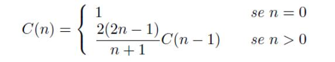

## Catalan Number

Os números de Catalan são definidos pela seguinte recursão

Alguns números desta sequência são: **1, 1, 2, 5, 14, 42, 132, 429, 1430, 4862, 16796,
58786...**

Faça uma função recursiva que receba um número N e retorne o N-ésimo número de
**Catalan**.