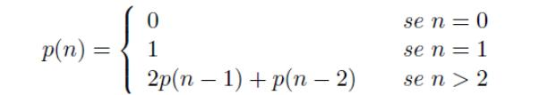

## Pell Number

Os números de Pell são definidos pela seguinte recursão:

Alguns números desta sequência são: **0, 1, 2, 5, 12, 29, 70, 169, 408, 985...**

Faça uma função recursiva que receba um número N e retorne o N-ésimo número de
Pell.